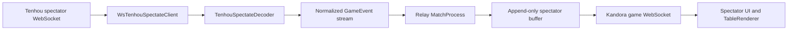

# Tenhou live spectating

Kandora can relay an ongoing Tenhou game into the standard spectator UI. The
integration translates Tenhou's private spectator WebSocket protocol into the
platform-neutral `GameEvent` stream used by Kandora replays and live matches.
Browsers connect only to the Kandora game server; they never connect directly
to Tenhou.

## Data flow



The main components are:

- [`tenhouClient.ts`](../../server/src/relay/tenhouClient.ts): owns the upstream
  socket, Tenhou handshake, keepalive, and reconnect loop.
- [`spectateDecoder.ts`](spectateDecoder.ts): incrementally converts `UN`,
  `INITBYLOG`, and `WGC` frames into `GameEvent`s.
- [`relayController.ts`](../../server/src/relay/relayController.ts): shares one
  upstream connection per watch ID, injects decoded events into a relay match,
  tracks viewers, and tears relays down.
- [`match.ts`](../../server/src/match.ts): buffers relay events and fans them out
  through the normal spectator WebSocket protocol.
- [`replayAdapter.ts`](replayAdapter.ts): provides the shared Tenhou tile, meld,
  score, and hand-result decoding used by XML replays and live spectating.

## Tenhou protocol

The upstream client connects to `wss://b-ww.mjv.jp/` by default and performs
the observed spectator handshake:

1. Send `HELO`.
2. Receive `HELO`, then send `WG` with the eight-character watch ID.
3. Receive `GO`, then send `GOK`.
4. Receive player metadata in `UN` and a spectator notice in `KANSEN`.
5. Receive a catch-up snapshot in `INITBYLOG`, followed by incremental `WGC`
   batches.
6. Send `<Z/>` keepalives every ten seconds.

`INITBYLOG.childNodes` and `WGC.childNodes` contain numeric presentation delays
and Tenhou game elements. The semantic decoder recognizes:

- `INIT` for hand state, scores, dealer, dice, dora, and all four starting hands
- `T/U/V/W` draws and `D/E/F/G` discards
- packed `N.m` melds
- `REACH`, `DORA`, `AGARI`, and `RYUUKYOKU`
- an `owari` attribute on the final result as the authoritative match end

All four starting hands are present in the observed spectator feed, so relay
spectators receive the omniscient projection. Future wall order and dead-wall
contents are not available because live frames do not include the `SHUFFLE`
seed present in completed Tenhou XML logs.

## Delayed startup

Tenhou builds a five-minute spectator-delay buffer when a game begins. A relay
may complete `GO`, `UN`, and `KANSEN` before any game payload is available. The
decoder therefore emits player metadata immediately and remains valid while no
`INITBYLOG` or `WGC` frame has arrived.

The HAR adapter also preserves the wall-clock interval from `GO` to the first
game payload. In the current fixture, the first join waits 123.586 seconds for
the remainder of the delay window. That wait is attached to the first domain
event produced by the game payload, so offline playback shows the same waiting
phase before `hand_start`. Reconnect snapshots arrive immediately and do not
repeat the startup wait.

Numeric child nodes remain presentation timing metadata rather than
`GameEvent`s. [`spectateHarAdapter.ts`](spectateHarAdapter.ts) projects those
values onto the corresponding domain events for the development simulator.

## Reconnect behavior

The upstream client reconnects three seconds after an unexpected close and
repeats the handshake. Tenhou responds with an overlapping catch-up snapshot.
The stateful decoder keys hands by the `INIT.seed` value and replaces a shorter
copy of a hand with the reconnect snapshot. It then reparses the accumulated
elements and emits only events beyond its monotonic cursor.

This prevents duplicated `hand_start`, draw, discard, and result events when a
snapshot overlaps data already delivered. A real `match_end` is emitted only
when `AGARI` or `RYUUKYOKU` includes `owari`; the whole-log parser's synthetic
end is removed from open streams.

## Relay lifecycle

`RelayController.start(watchId)` creates a spectator-only `MatchProcess` and
starts one upstream Tenhou client. Calling it again with the same watch ID
returns the existing match ID. By default:

- at most 20 relays may be active;
- a relay with no spectators is removed after 60 seconds;
- the upstream socket and all downstream spectator sockets close at
  `match_end`;
- closing a relay archives its buffered stream as a Tenhou replay, including a
  partial stream after idle teardown;
- late spectators receive the existing event buffer before live updates.

The game server exposes secret-authenticated control endpoints:

| Endpoint | Purpose |
| --- | --- |
| `POST /relay/start` | Start or reuse a relay from `{ "watchId": "..." }` |
| `POST /relay/stop` | Stop a relay by watch ID |
| `GET /relay/stats` | Return active relay, viewer, and capacity counts |

All control requests require `x-relay-secret`. An unset `RELAY_SECRET` disables
authorization rather than creating an unprotected endpoint: every request is
rejected.

### Configuration

| Variable | Component | Description |
| --- | --- | --- |
| `GAME_ENABLED` | App and game server | Enables game and spectator routes |
| `GAME_SERVER_URL` | Tournament app | Base URL used for relay-control calls |
| `RELAY_SECRET` | Both | Shared secret for relay-control endpoints |
| `RELAY_MAX_CONCURRENT` | Game server | Concurrent upstream relay cap; default `20` |
| `TENHOU_WS_URL` | Game server | Upstream endpoint; default `wss://b-ww.mjv.jp/` |
| `TENHOU_ORIGIN` | Game server | WebSocket `Origin`; default `https://tenhou.net` |
| `TENHOU_RELAY_ID` | Game server | Name sent in the upstream `HELO` frame |

## Tournament integration

The tournament poller obtains Tenhou watch IDs and stores ongoing games in
`LiveGame`. The statistics Games tab renders a live-watch action only when a
Tenhou game has a watch ID.

The action posts the watch ID to
[`watch.ts`](../../../routes/api/game/watch.ts). That route accepts only watch
IDs currently present in `LiveGame`, preventing arbitrary browser input from
opening upstream connections. It calls the game server through
[`gameServer.server.ts`](../../../services/gameServer.server.ts), stores the
returned relay match ID, and sends the browser to `/spectate/:matchId`.

## Offline fixture and tests

The repository-root `extract.har` is a development fixture captured from a
complete game. The current capture contains two WebSocket upgrades, five joins
to one watch ID, and 879 frames over about 1,630.5 seconds. Merging overlapping
snapshots produces 870 schema-valid events over eight hands:

- 1 match start and 1 authoritative match end
- 8 hand starts and 8 hand ends
- 416 draws and 420 discards
- 9 calls and 7 wins

The fixture tests validate every event with `GameEventSchema`, fold independent
sessions and the merged stream through the replay reducer, verify reconnect
deduplication and delayed startup, and fail when a capture introduces an
unknown top-level or nested game tag.

Run the focused tests with:

```bash
npx vitest run app/api/tenhou/spectateHarAdapter.spec.ts app/api/tenhou/spectateDecoder.spec.ts
```

In development, `/replays/tenhou-har` plays the fixture as a growing stream. It
supports captured timing, multiple speeds, feed and view pause, buffered
scrubbing, follow-live, seat focus, visible hands, and wait overlays. This route
is unavailable in production.

## Current limitations

- The upstream protocol is private and undocumented and may change without
  notice.
- Server-side origin acceptance, relay identity requirements, and operating
  limits still require validation against Tenhou's terms and production use.
- Watch-ID discovery is outside the decoder and relay. The tournament poller
  must provide a current eight-character ID.
- Captures do not yet cover multiple ron, every kan type, abortive draws,
  three-player games, invalid watch IDs, or every disconnect boundary.
- Unknown tags are detected by fixture tests, but the live decoder does not yet
  expose structured unknown-tag telemetry or force a resync.
- Numeric child values are treated as presentation delays based on observed
  behavior; Tenhou does not document their contract.
- Live streams cannot reconstruct unrevealed wall or dead-wall tiles without a
  `SHUFFLE` seed.
